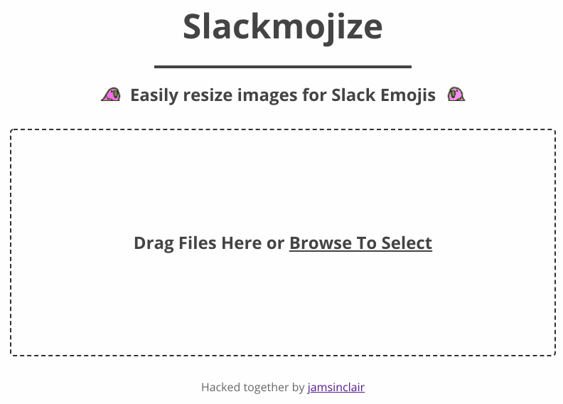

# Slackmojize

Easily resize images in your browser for Slack Emoji Upload! Let this react app take care of it for you.

----------



https://jamsinclair.github.io/slackmojize

Slack emoji uploads used to be quite restrictive:
> Image can't be larger than 128px in width or height, and must be smaller than 64K in file size.

To make this resize process easier I made this simple tool to resize emoji to be suitable for upload. 

The app can batch resize `JPEG` and `PNG` files in your browser entirely clientside. Gif support pending, trickier to do in the browser.

> ℹ️ Slack has now updated their emoji creation form to allow larger files. Their servers then try and resize the files correctly. For one off emoji creation, especially gifs, their form is a faster approach.

## Development

To run the app locally:
```shell
yarn install && yarn start
# or npm install && npm start
```
